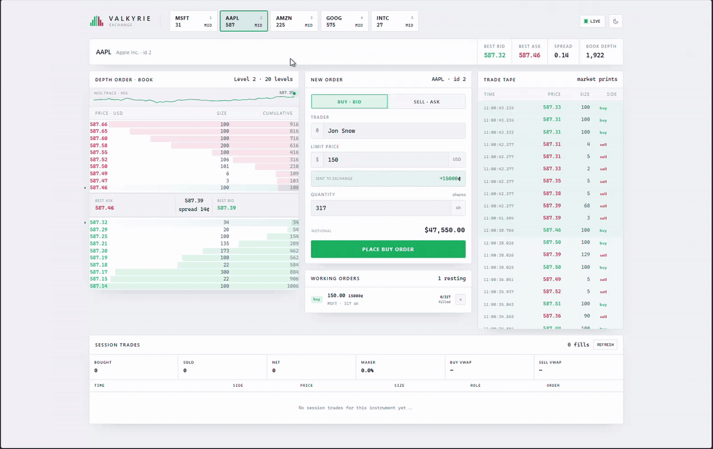
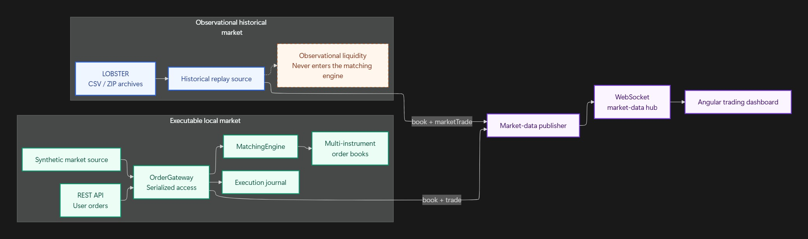

# Valkyrie


Valkyrie is an in-memory limit-order book and matching engine built with C# and .NET 10.

It includes custom FIFO and pro-rata matching algorithms, multi-instrument order books, an ASP.NET Core API, live WebSocket market data, synthetic market simulation, LOBSTER historical market-data replay, and an Angular trading dashboard.

No exchange or order-book libraries are used. The book structures, matching logic, allocation mathematics, and market-data pipeline are implemented from scratch.



*Historical LOBSTER depth and market prints streaming through the five-instrument Angular dashboard.*

---

## See it in action

| Mode | What it demonstrates | Launch profile |
|---|---|---|
| Synthetic market | Executable liquidity flowing through the local matching engine | `simulated-market` |
| Historical replay | Observational LOBSTER books and market prints streamed at configurable speed | `historical-replay` |

Run either mode with `dotnet run --project Valkyrie --launch-profile <profile>`, then start the Angular client from `Frontend` with `npm start`. Historical replay also requires the [sample-data setup](#obtaining-lobster-data).

---

## Architecture at a glance



Historical replay deliberately joins the system at the market-data layer. It never seeds or mutates the local order book, so displayed historical liquidity cannot execute a user order.

---

## Features

### Matching engine

- Multi-instrument limit-order books
- Matching algorithms: FIFO, pro-rata
- Partial and multi-level fills
- Order placement, modification, and cancellation
- Aggregated bid/ask snapshots
- Thread-safe API access through `OrderGateway`

### Market data

- Full WebSocket order-book snapshots
- Local matching-engine trade events
- Observed historical market-trade events
- Per-instrument subscriptions
- Synthetic multi-instrument market simulation
- LOBSTER replay from CSV directories or ZIP archives
- Configurable playback speed, book publication rate, and looping

### Angular dashboard

- Live depth ladder
- Best bid, best ask, spread, and total depth
- Rolling mid-price traces
- Live trade tape
- Buy and sell limit-order entry
- Working-order and partial-fill tracking
- Order cancellation
- Trade history
- Buy and sell VWAP(Volume Weighted Average Price)
- Net executed quantity
- Maker participation percentage
- Persistent light and dark theme preference

---

## Matching algorithms

The active algorithm is selected in `Valkyrie/appsettings.json`:

```json
{
  "MatchingEngineConfiguration": {
    "Algorithm": "Fifo"
  }
}
```

Supported values (for now) are:

- `Fifo`
- `ProRata`

### FIFO

FIFO uses price-time priority. The best available price is matched first, and orders at the same price are filled in arrival order.

### Pro-rata

Pro-rata distributes incoming quantity across resting orders at the best price in proportion to their sizes.

```text
Resting asks at $1.00:

Order #2: 100 shares
Order #3: 200 shares
Order #4: 300 shares
Total:    600 shares

Incoming buy: 300 shares at $1.00

Fills:

Order #2:  50 shares
Order #3: 100 shares
Order #4: 150 shares
```

Fractional allocation remainders are distributed using largest-remainder allocation, with time priority used to break ties.

---

## Design decisions

### Integer prices

Prices are represented as `long` integer cents rather than floating-point values. This keeps price comparisons and executions deterministic and avoids floating-point drift in the matching path.

### Order-book structure

Each instrument uses:

- `SortedSet<Limit>` for ordered bid and ask price levels
- `Dictionary<long, OrderbookEntry>` for direct order lookup
- Doubly linked entries within each price level

This provides O(log n) price-level insertion and lookup, O(1) order lookup, and O(1) linked-list cancellation after lookup.

### Resting-price execution

Crossing orders execute at the resting order's price. For example, a buy order priced at `$101.00` crossing a resting sell at `$100.00` executes at `$100.00`.

### Full-book snapshots

Market-data book messages contain the complete aggregated book rather than incremental deltas.

Full snapshots consume more bandwidth, but they are stateless and self-healing: newly connected or temporarily disconnected clients can become correct from a single message.

### Execution journal

Trader executions are written to an append-only, in-memory execution journal.

The journal supports session-scoped execution history and analytics while keeping the matching engine independent of dashboard concerns. Execution history survives browser refreshes but is cleared when the backend process restarts.

---

## Project structure

```text
TradingEngineServer/
|-- Instruments/       Instrument reference data
|-- Orders/            Orders, limits, comparers, and linked entries
|-- OrderBook/         Bid/ask book implementation
|-- MatchingEngine/    FIFO and pro-rata matching
|-- Logging/           Asynchronous text logging
|-- Valkyrie/          ASP.NET Core API and simulator
|-- Frontend/          Angular trading dashboard
`-- UnitTests/         Domain, matching-engine, and API tests
```


The matching engine remains responsible only for matching. API transport, market-data publication, simulator flow, and session execution tracking are handled outside the core algorithm.

---

## Requirements

Install:

- [.NET 10 SDK](https://dotnet.microsoft.com/download)
- [Node.js 22](https://nodejs.org/)
- npm

---

## Running locally

The server and client run as separate processes.

### 1. Start the server 

From the repository root:

```powershell
dotnet restore Valkyrie.slnx
dotnet run --project .\Valkyrie
```

It runs at:

```text
http://localhost:5000
```

### 2. Start with synthetic market data

The simulator is disabled by default. Enable it with the checked-in launch profile:

```powershell
dotnet run --project .\Valkyrie --launch-profile simulated-market
```

In Rider, add the following environment variable to the Valkyrie run configuration:

```text
MarketSimulatorConfiguration__Enabled=true
```

### 3. Start with historical market data

Historical replay requires compatible LOBSTER files that are not included in this repository. Follow the data-placement instructions in [Historical market-data replay](#historical-market-data-replay), then run:

```powershell
dotnet run --project .\Valkyrie --launch-profile historical-replay
```

The checked-in profile enables the simulator and selects `LobsterReplay` as its market-data source.

The default configuration replays the 2012-06-21 session at 1x speed, publishes at most five book snapshots per second per instrument, and stops after one pass. Restart the backend to replay it again.

### 4. Start the Angular dashboard

Open a second terminal:

```powershell
cd .\Frontend
npm ci
npm start
```

Open:

```text
http://localhost:4200
```

The Angular development server proxies REST and WebSocket requests to the backend on port `5000`. Both processes must be running for the complete dashboard to work.

---

## Configuration

Instrument and simulator configuration lives in `Valkyrie/appsettings.json`.

```json
{
  "MatchingEngineConfiguration": {
    "Algorithm": "Fifo"
  },
  "Instruments": [
    {
      "SecurityId": 1,
      "Ticker": "MSFT",
      "Name": "Microsoft Corporation"
    }
  ],
  "MarketSimulatorConfiguration": {
    "Enabled": false,
    "Source": "Synthetic",
    "HistoricalReplay": {
      "PlaybackSpeed": 60,
      "MaxBookUpdatesPerSecond": 5,
      "Loop": false,
      "Instruments": [
        {
          "SecurityId": 1,
          "Ticker": "MSFT",
          "DataFormat": "ZipArchive",
          "DataPath": "../ReplayData/LOBSTER_SampleFile_MSFT_2012-06-21_10.zip",
          "SessionMidnight": "2012-06-21T00:00:00-04:00",
          "BookDepth": 10
        }
      ]
    }
  }
}
```

The top-level instrument catalogue is canonical. Historical replay validates each configured security ID and ticker against that catalogue.

Supported market-data sources are:

- `Synthetic`
- `LobsterReplay`

`MarketSimulatorConfiguration.Enabled` must be `true` for either source to run. The checked-in launch profiles set these values automatically.

Prices are expressed in integer cents:

```text
41800 = $418.00
```

---

## Historical market-data replay

> **Important:** Historical books and prints are observational market data. They are not executable liquidity.

The replay source publishes historical book snapshots and `marketTrade` messages directly to the market-data feed. It does not seed or modify the local matching engine.

Orders submitted through the dashboard or REST API continue to execute only against the separate local matching-engine book. A price level displayed from historical replay cannot currently fill a user order, even though both may use the same security ID.

### Obtaining LOBSTER data

The default configuration uses LOBSTER's official depth-10 sample files for MSFT, AAPL, AMZN, GOOG, and INTC. Each download link below points directly to the corresponding ZIP archive hosted by LOBSTER.

LOBSTER data is not mirrored or redistributed by this repository. Access and use remain subject to the data provider's applicable terms.

ZIP streaming is the checked-in default and requires no extraction. Create a directory named `ReplayData` at the repository root, then save each archive at the path shown:

| Ticker | Official depth-10 sample | Required local path |
|---|---|---|
| MSFT | [Download ZIP](https://php.lobsterdata.com/info/sample/LOBSTER_SampleFile_MSFT_2012-06-21_10.zip) | `ReplayData/LOBSTER_SampleFile_MSFT_2012-06-21_10.zip` |
| AAPL | [Download ZIP](https://php.lobsterdata.com/info/sample/LOBSTER_SampleFile_AAPL_2012-06-21_10.zip) | `ReplayData/LOBSTER_SampleFile_AAPL_2012-06-21_10.zip` |
| AMZN | [Download ZIP](https://php.lobsterdata.com/info/sample/LOBSTER_SampleFile_AMZN_2012-06-21_10.zip) | `ReplayData/LOBSTER_SampleFile_AMZN_2012-06-21_10.zip` |
| GOOG | [Download ZIP](https://php.lobsterdata.com/info/sample/LOBSTER_SampleFile_GOOG_2012-06-21_10.zip) | `ReplayData/LOBSTER_SampleFile_GOOG_2012-06-21_10.zip` |
| INTC | [Download ZIP](https://php.lobsterdata.com/info/sample/LOBSTER_SampleFile_INTC_2012-06-21_10.zip) | `ReplayData/LOBSTER_SampleFile_INTC_2012-06-21_10.zip` |

The [LOBSTER sample-data page](https://php.lobsterdata.com/info/info/info/DataSamples.php) also provides other book depths. Review the [LOBSTER output structure](https://data.lobsterdata.com/info/DataStructure.php) for message fields, event types, prices, and paired order-book rows. For other tickers or dates, use the [LOBSTER data platform](https://app.lobsterdata.com/) and review its [access documents](https://data.lobsterdata.com/info/Documents.php).

`ReplayData/` and `ReplayDataCache/` are ignored by Git.

### Required dataset pair

Each configured input must contain exactly one matching message/order-book pair for its configured depth:

```text
{TICKER}_{YYYY-MM-DD}_{start}_{end}_message_{depth}.csv
{TICKER}_{YYYY-MM-DD}_{start}_{end}_orderbook_{depth}.csv
```

The two files must have the same prefix. The configured ticker and session date must match that prefix, and the configured book depth must match the filename suffix.

The application rejects:

- Missing or duplicate message/order-book files
- Message and order-book files from different datasets
- Ticker or session-date mismatches
- Replay security IDs or tickers that disagree with the canonical instrument catalogue
- Invalid or missing configured paths

### Input formats

`DataFormat` supports:

- `ZipArchive`: streams the paired CSV files directly from one ZIP archive without extracting it. This is the default and recommended setup.
- `CsvDirectory`: streams one matching pair from an extracted directory.

Relative `DataPath` values are resolved from the `Valkyrie` content root. The checked-in `../ReplayData/...` paths therefore refer to the repository-level `ReplayData/` directory.

#### Using extracted CSV files

Extract each archive into its own ticker-specific directory. Do not place all five message/order-book pairs directly in the shared `ReplayData` directory: the CSV provider requires exactly one matching pair in each configured directory and rejects duplicate matches.

For example:

```text
ReplayData/
`-- LOBSTER_SampleFile_MSFT_2012-06-21_10/
    |-- MSFT_2012-06-21_34200000_57600000_message_10.csv
    `-- MSFT_2012-06-21_34200000_57600000_orderbook_10.csv
```

Then change that instrument's `DataFormat` and `DataPath`:

```json
{
  "SecurityId": 1,
  "Ticker": "MSFT",
  "DataFormat": "CsvDirectory",
  "DataPath": "../ReplayData/LOBSTER_SampleFile_MSFT_2012-06-21_10",
  "SessionMidnight": "2012-06-21T00:00:00-04:00",
  "BookDepth": 10
}
```

Repeat this directory and configuration pattern for each ticker. The `historical-replay` launch profile does not change; it selects the replay source, while each instrument's `DataFormat` and `DataPath` select how its data is opened. No CSV conversion, file renaming, or cache generation is required.

### Replay behaviour

Each configured instrument replays independently and concurrently.

- `PlaybackSpeed` scales historical elapsed time.
- `MaxBookUpdatesPerSecond` limits book publication frequency.
- `Loop` reopens each input after all configured instruments complete.
- Visible and hidden LOBSTER executions produce `marketTrade` messages.
- Book snapshots are coalesced to the configured publication rate.
- Execution prints skipped between book publications are retained and emitted immediately before the next published book.
- Historical timestamps are preserved on market-trade messages.
- Instruments are not merged onto one globally ordered historical clock.

With `Loop` set to `false`, restart the backend after the replay completes.

---

## REST API

The API is available at `http://localhost:5000`.

| Method | Route | Purpose |
|---|---|---|
| `GET` | `/instruments` | Read the canonical instrument catalogue |
| `POST` | `/orders` | Submit an order |
| `PUT` | `/instruments/{securityId}/orders/{orderId}` | Modify an order |
| `DELETE` | `/instruments/{securityId}/orders/{orderId}?username={username}` | Cancel an order |
| `GET` | `/book/{securityId}` | Read an aggregated book snapshot |
| `POST` | `/sessions` | Create a browser trading session |
| `GET` | `/sessions/{sessionId}/executions` | Read session trades |
| `GET` | `/sessions/{sessionId}/executions?securityId={id}` | Filter session trades by instrument |

Prices are integer cents and order sides are `"Buy"` or `"Sell"`.

### Submit an order

`POST /orders`

Request body:

```json
{
  "securityId": 1,
  "username": "sam",
  "side": "Sell",
  "price": 41800,
  "quantity": 100,
  "sessionId": "optional-session-guid"
}
```

`sessionId` is optional. Supplying one associates resulting executions with that client session.

Successful response: `201 Created`

```json
{
  "orderId": 1,
  "matched": false,
  "fills": []
}
```

### Read the order book

`GET /book/1`

The security ID is part of the route. A configured instrument returns its current aggregated local matching-engine book; an unknown security ID returns `404 Not Found`.

### Create a trading session

`POST /sessions`

Successful response: `201 Created`

```json
{
  "sessionId": "generated-guid",
  "createdAt": "UTC timestamp"
}
```

Pass the returned `sessionId` when submitting orders if execution-history tracking is required.

---

## WebSocket market data

The market-data WebSocket is available at:

```text
ws://localhost:5000/ws/marketdata
```

Clients subscribe by instrument:

```json
{
  "action": "subscribe",
  "securityId": 1
}
```

The server publishes three message types:

- `book`: a complete aggregated bid/ask snapshot
- `trade`: a local matching-engine fill containing bid and ask order IDs
- `marketTrade`: an observed external execution containing its historical timestamp but no local order IDs

Only `trade` messages represent fills produced by Valkyrie's matching engine. A `marketTrade` message is observational and must not be interpreted as a fill of a user order.

Local matching-engine prices use integer cents. Historical market-trade prices use decimal cents because LOBSTER hidden executions can occur at sub-cent dollar prices.

---

## Session trades

The dashboard creates a browser-scoped trading session and attaches its ID to submitted orders.

The Session Trades panel shows:

- Individual fills
- Order side
- Execution price and quantity
- Order ID
- Maker or taker role
- Buy and sell VWAP
- Net executed quantity
- Maker participation percentage

The browser retains the session ID through page refreshes using `sessionStorage`.

The execution journal is currently in memory, so restarting the backend clears its history(for now...).

---

## Market simulator

The synthetic market source runs one order-flow loop per configured instrument.

It generates:

- Resting liquidity
- Cancellations
- Crossing orders
- Partial fills
- Price movement around a simulated fair value
- Poisson-style arrival timing

Simulator orders travel through the same `OrderGateway` and matching engine as API orders.

Synthetic simulation and historical replay both implement `IMarketDataSource`. Configuration selects one source without changing the host or matching engine.

---

## Logs

Text logs are written under `logs/` in date-stamped directories.

Tail the newest log in PowerShell:

```powershell
$latestLog = Get-ChildItem "logs/*/*.log" |
    Sort-Object LastWriteTime -Descending |
    Select-Object -First 1

Get-Content $latestLog.FullName -Wait
```

---

## Building and testing

### Complete .NET solution

```powershell
dotnet restore Valkyrie.slnx
dotnet build Valkyrie.slnx --no-restore
dotnet test Valkyrie.slnx --no-build
```

Stop any running Valkyrie backend before building or testing on Windows. A running process can lock compiled DLLs.

### Angular frontend

```powershell
cd .\Frontend
npm ci
npm run build
npm test -- --watch=false
```

---
## Technology

| Layer | Technology |
|---|---|
| Runtime | .NET 10 |
| Backend | ASP.NET Core Minimal APIs |
| Language | C# |
| Matching | Custom FIFO and pro-rata algorithms |
| Frontend | Angular 21 |
| Frontend language | TypeScript 5.9 |
| Reactive state | Angular signals and RxJS |
| Testing | xUnit, FluentAssertions, and Vitest |
| Transport | HTTP and WebSocket |
| Hosting | Kestrel |

---

## Current limitations

- Application state is held in memory
- Executions are cleared when the backend restarts
- Username is caller-supplied; authentication is not implemented
- Market-data updates use full snapshots rather than deltas
- Order IDs restart with the backend process
- Session execution updates currently use HTTP refreshes rather than a private execution stream
- Historical replay liquidity is observational and cannot currently execute user orders
- Order entry remains enabled while historical replay is displayed
- Historical instruments replay concurrently without one globally merged clock
- Real LOBSTER archives are local-only and are not exercised by CI
- Replay data is not downloaded or distributed by this repository
