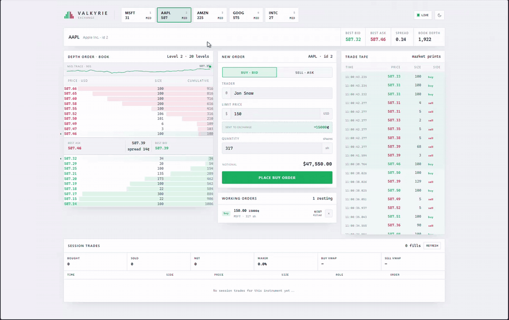

# Valkyrie

## What is it?

It's a limit order book + matching engine... essentially the core of an exchange(think NASDAQ, NYSE, Binance etc)




Since I don't have access to an actual live market data feed, I configured the project to work in two ways:

1. With "random" mock data generated by the system: `simulated-market`
2. With historical data samples I was able to get my hands on from LOBSTER: `historical-replay`

For example, if I wanted to run with a simulated market, I would do:

```bash
dotnet run --project Valkyrie --launch-profile simulated-market
```

For the historical replay:

```bash
dotnet run --project Valkyrie --launch-profile historical-replay
```

## How to get the historical replay data from LOBSTER

Create a `ReplayData` directory in the root of the project and put the files there.

| Ticker | Official depth-10 sample | Required local path |
|---|---|---|
| MSFT | [Download ZIP](https://php.lobsterdata.com/info/sample/LOBSTER_SampleFile_MSFT_2012-06-21_10.zip) | `ReplayData/LOBSTER_SampleFile_MSFT_2012-06-21_10.zip` |
| AAPL | [Download ZIP](https://php.lobsterdata.com/info/sample/LOBSTER_SampleFile_AAPL_2012-06-21_10.zip) | `ReplayData/LOBSTER_SampleFile_AAPL_2012-06-21_10.zip` |
| AMZN | [Download ZIP](https://php.lobsterdata.com/info/sample/LOBSTER_SampleFile_AMZN_2012-06-21_10.zip) | `ReplayData/LOBSTER_SampleFile_AMZN_2012-06-21_10.zip` |
| GOOG | [Download ZIP](https://php.lobsterdata.com/info/sample/LOBSTER_SampleFile_GOOG_2012-06-21_10.zip) | `ReplayData/LOBSTER_SampleFile_GOOG_2012-06-21_10.zip` |
| INTC | [Download ZIP](https://php.lobsterdata.com/info/sample/LOBSTER_SampleFile_INTC_2012-06-21_10.zip) | `ReplayData/LOBSTER_SampleFile_INTC_2012-06-21_10.zip` |

# Other configurations

You can take a peek into `Valkyrie/appsettings.json` and change some stuff. For example, you can switch the matching algorithm being used.

The project currently supports two:

1. `Fifo`
2. `ProRata`

Simply put:
FIFO is just First-In-First-Out, the first one resting at the best price gets filled first.
ProRata splits the incoming order across every resting order at the best price proportionally.

To switch to ProRata, modify the JSON file like this:

```json
{
  "MatchingEngineConfiguration": {
    "Algorithm": "ProRata"
  }
}
```

  ## Design Decisions
I decided to store prices as `long` integer cents not floats...it's standard finance practice. 

Market data pushes full snapshots instead of delta snapshots, it costs more but it simplifies things at this stage.

  ## REST API overview
  Since this isn't a "traditional web project" I decided to keep the API layer as thin as possible with ASP.NET Minimal APIs instead of going with the standard MVC route.

  POST /orders    --> to submit order
  GET  /book/{id} --> to obtain a snapshot
  /ws/marketdata  --> to get the live feed
  
# Getting Started
Install:

- .NET 10 SDK
- Node.js
- npm

# How to run the project
Depends on how you want to configure it.

I'm currently working on a separate project, [Sköll](https://github.com/Semilore317/skoll-cpp), that's meant to be a client for the trading engine, so in that case you might not need to start the Valkyrie frontend.

## Starting the Valkyrie server
From the project root:

```bash
dotnet restore Valkyrie.slnx
dotnet run --project Valkyrie
```

If you want the simulated market instead:

```bash
dotnet run --project Valkyrie --launch-profile simulated-market
```

## Starting the Valkyrie frontend
From another terminal:

```bash
cd Frontend
npm install
npm start
```